# 🚗 Zig-Zag Car Adventure

<p align="center">
  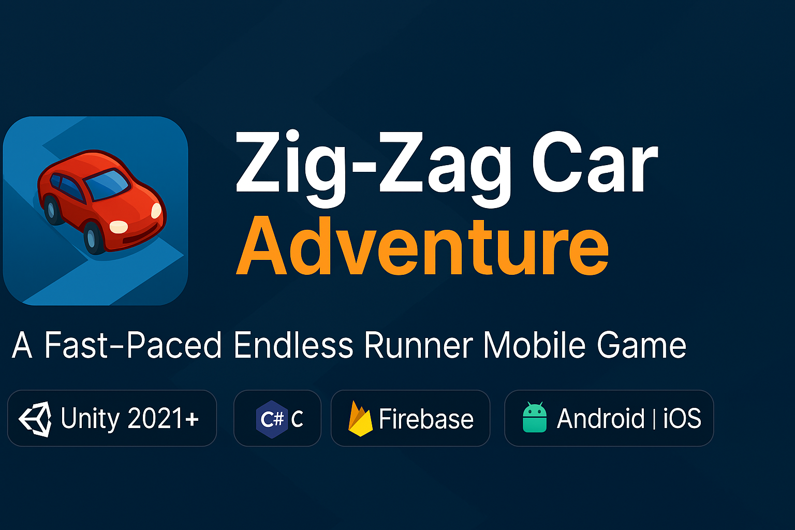
</p>

<p align="center">
  <b>A Fast-Paced Endless Runner Mobile Game Built with Unity, Firebase & C#</b>
</p>

<p align="center">
  
  
  
  
  
</p>

---

## 🎮 Overview

**Zig-Zag Car Adventure** is a thrilling endless runner where players drive a car across zig-zag paths, collect diamonds, unlock vehicles, and challenge high scores.  

Built with **Unity**, powered by **Firebase Authentication**, and monetized with **Unity Ads** — fully optimized for mobile devices.

---

## ✨ Features

### 🚗 Car Systems
- Unlockable cars  
- Dynamic car selection menu  
- Smooth transitions & animations  

### 🔐 Firebase Authentication
- Email / Password login  
- Password recovery  
- Real-time validation & error alerts  

### 🎮 Gameplay
- Procedural infinite zig-zag tracks  
- One-tap gameplay  
- Diamonds & star-based scoring  
- High score tracking  

### 📢 Monetization
- Rewarded Ads  
- Interstitial Ads  

### 🎨 UI & UX
- Modern UI using TextMesh Pro  
- Mobile-friendly UX  
- Clean animations  

---

## 📸 Preview

### 🔐 Authentication Flow
<p align="center">
  
  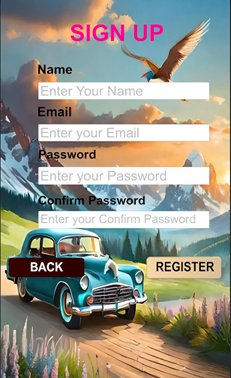
  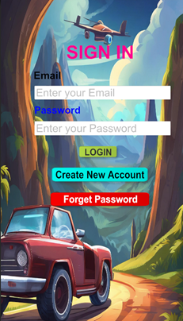
  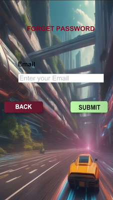
</p>

### 🚗 Car Selection & Store
<p align="center">
  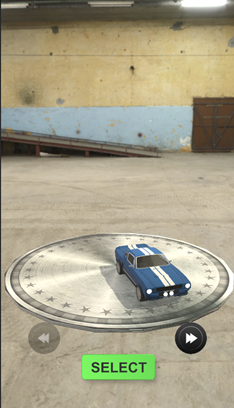
  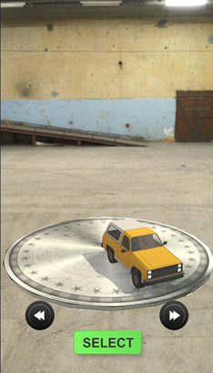
  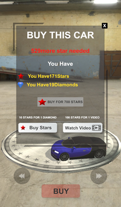
</p>

### 🎮 Gameplay
<p align="center">
  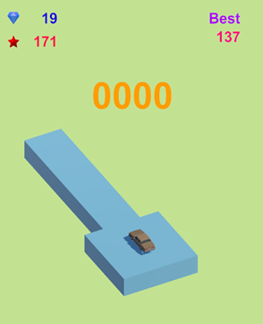
  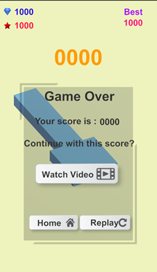
  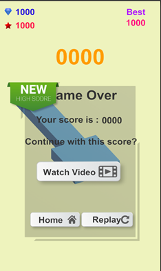
</p>

### ⚠️ Error & Logout
<p align="center">
  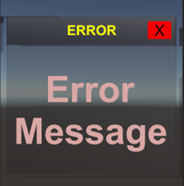
  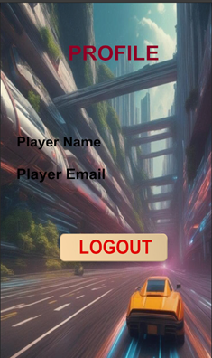
</p>

---

## 🛠️ Tech Stack

| Category   | Technology              |
|-----------|-------------------------|
| Engine    | Unity 2021+             |
| Language  | C#                      |
| Backend   | Firebase Authentication |
| Ads       | Unity Ads               |
| UI        | TextMesh Pro            |
| Platforms | Android & iOS           |

---

## 🚀 Getting Started

### ✅ Requirements
- Unity Hub  
- Unity 2021 or later  
- Firebase account  
- Android SDK / Xcode  

---

### 📥 Clone Project
```bash
git clone https://github.com/bhavyadoshi12/Zig-Zag_Car_Adventure.git
cd Zig-Zag_Car_Adventure
````

---

## 🔥 Firebase Setup

1. Create a Firebase project
2. Enable **Email/Password Authentication**
3. Download:

   * `google-services.json` (Android)
   * `GoogleService-Info.plist` (iOS)
4. Move files to the `Assets/` folder

---

## ▶️ Run the Game

1. Open the project in **Unity Hub**
2. Load the scene:

   ```
   Assets/Scenes/FirebaseAuth.unity
   ```
3. Press **Play**

---

## 🏗️ Build for Mobile

1. File → Build Settings
2. Select Android or iOS
3. Configure SDKs
4. Click **Build**

---

## 🎯 How to Play

* Sign up / log in
* Pick a car
* Tap to switch direction
* Collect diamonds 💎
* Don’t fall
* Beat your high score 🏆

---

## 📁 Project Structure

```
Zig-Zag_Car_Adventure/
│── Assets/
│── Output_Images/
│── Packages/
│── ProjectSettings/
│── README.md
```

---

## 📝 Notes

* 🔒 **Never commit Firebase config files publicly**
* 📱 Works on modern Android & iOS devices
* 🎮 Ideal for Unity & game-dev portfolios

---

## 🤝 Contributing

Contributions are welcome!
Fork → Improve → Pull Request

---

## ⭐ Support

If you like this project, consider giving it a ⭐ on GitHub.

---

## 👨‍💻 Author

**Bhavya Ketan Doshi**
